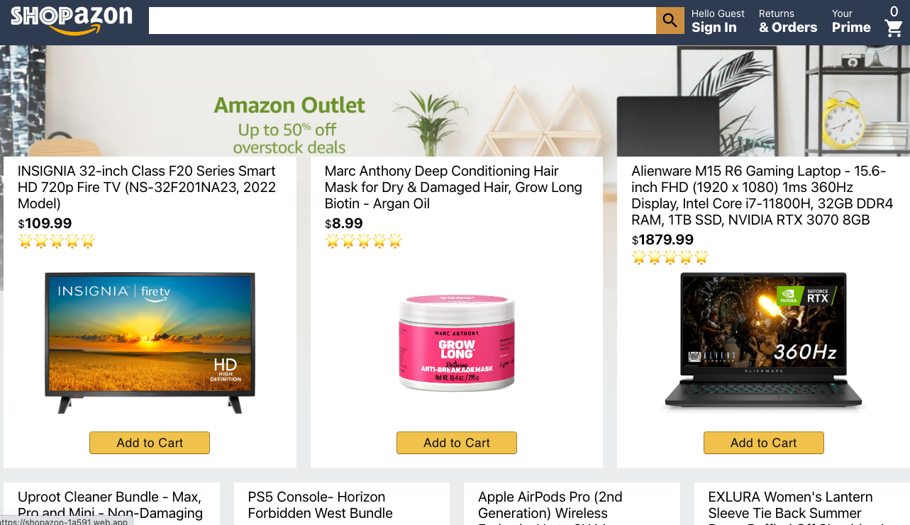
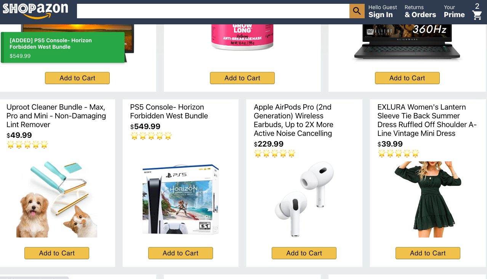
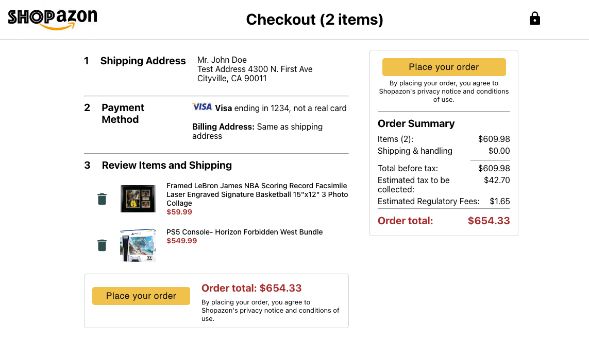

# shopazon react

Shopazon is deployed at this site: [https://shopazon-1a591.web.app/](https://shopazon-1a591.web.app/)

## About this Project
- Online shopping portal
- Shopping cart can add and remove items
- Authentication (Registration and Sign In, Sign Out)
- Notifications for shopping cart and authentication

You can click "Add to Cart" and a green notification will appear showing the item that you added.  In the top right there is also a counter that shows how many items are in your shopping cart.  **If you try to check out as a guest, the site will remind you to login.**

Checkout is also simulated, with a non-real address and credit card.  When you "Place your order" it will notify you of a completed order and reset the shopping cart to empty.

## Stack

### Project

| Dependencies  | Description |
| ------------- | ------------- |
|  React / React Router | Library |
|  Firebase | Database & Deployment |
|  [https://www.npmjs.com/package/react-notifications-component](https://www.npmjs.com/package/react-notifications-component)  | Notifications Component |
 